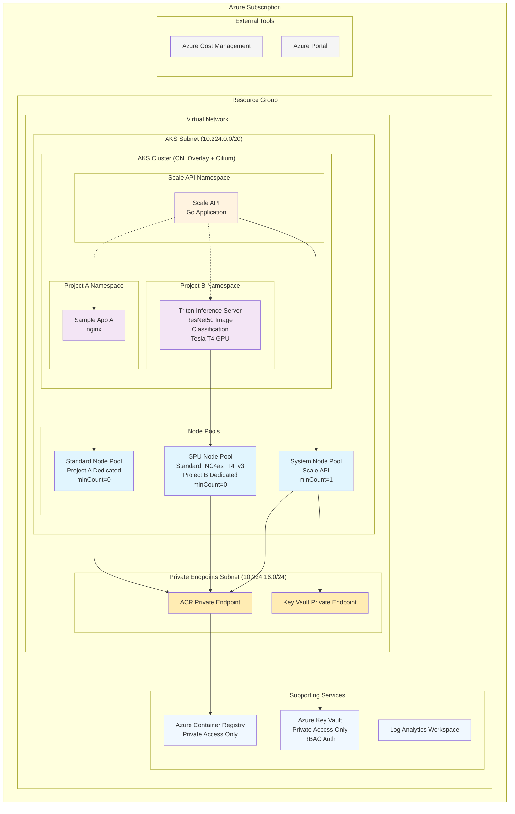

# AKS Scale to Zero

AKS（Azure Kubernetes Service）のコスト最適化を実現するScale to Zero機能のサンプル実装です。

## 概要

このプロジェクトは、複数プロジェクトでAKSクラスタを共有しながら、使用していない時間帯のリソースコストを削減するシステムのサンプル実装を提供します。特にGPUノードのような高コストなリソースのコスト最適化に焦点を当てています。

### 主な機能

- **Scale to Zero**: アプリケーション非使用時にノード数をゼロにしてコストを最小化
- **GPU対応**: NVIDIA Triton Inference ServerによるGPU推論サービスのコスト最適化
- **マルチプロジェクト対応**: 複数プロジェクトでのAKSクラスタ共有（Project A: 標準、Project B: GPU）
- **Azure Development CLI統合**: `azd`コマンドによる簡単なデプロイメント
- **Bicepテンプレート**: Infrastructure as Codeによる再現性の高い環境構築

## システム構成図



## アーキテクチャ

- **AKSクラスタ**: 3つのノードプール（System + Project A + Project B GPU）
  - CNI Overlayモード（Pod CIDR: 10.244.0.0/16）
  - Ciliumデータプレーン（eBPFベース）
- **Scale API**: Go実装のRESTful API（Deployment制御）
  - 構造化ログ出力（JSON形式）
- **サンプルアプリケーション**: 
  - Project A: nginx Webアプリケーション（静的コンテンツ配信）
  - Project B: NVIDIA Triton Inference Server（ResNet50画像分類、Tesla T4 GPU使用）
- **Azure統合**: 
  - Azure Container Registry（プライベートエンドポイント経由）
  - Log Analytics Workspace（監視・ログ収集）
  - Key Vault（API認証キー管理、プライベートエンドポイント経由）
- **GPU対応**: NVIDIA Device Plugin（DaemonSet）による GPU リソース管理
## 前提条件

- Azure サブスクリプション
- [Azure Developer CLI (azd)](https://learn.microsoft.com/azure/developer/azure-developer-cli/install-azd)
- [Azure CLI](https://docs.microsoft.com/cli/azure/install-azure-cli)
- [kubectl](https://kubernetes.io/docs/tasks/tools/)
- Docker（コンテナビルド用）
- jq（JSON処理用）

## セットアップ手順

### 1. リポジトリのクローン

```bash
git clone https://github.com/torumakabe/aks-scale-to-zero.git
cd aks-scale-to-zero
```

### 2. Azure環境の初期化

```bash
# Azure にログイン
az login
azd auth login

# 環境初期化
azd env new sample

# Azureのロケーションを設定（例: japaneast）
azd env set AZURE_LOCATION japaneast
```

### 3. デプロイ

```bash
# インフラストラクチャとアプリケーションをデプロイ
azd up
```

### 4. 動作確認

```bash
# AKSクラスタに接続
az aks get-credentials --resource-group $AZURE_RESOURCE_GROUP --name $AZURE_CLUSTER_NAME

# Scale API動作確認
kubectl port-forward -n scale-system svc/scale-api 8080:80 &
curl http://localhost:8080/health

# スケール操作テスト
curl -X POST -H "Content-Type: application/json" \
  -d '{"reason": "テスト実行"}' \
  http://localhost:8080/api/v1/deployments/project-a/sample-app-a/scale-to-zero

# ステータス確認
curl http://localhost:8080/api/v1/deployments/project-a/sample-app-a/status
```

## 📚 ドキュメント

### APIリファレンス
完全なAPI仕様については [API Reference](docs/api-reference.md) を参照してください。

**主要エンドポイント:**
- `GET /health` - APIサーバーの動作確認
- `GET /ready` - Kubernetes接続を含む準備状態確認
- `POST /api/v1/deployments/{namespace}/{name}/scale-to-zero` - Scale to Zero実行
- `POST /api/v1/deployments/{namespace}/{name}/scale-up` - スケールアップ実行
- `GET /api/v1/deployments/{namespace}/{name}/status` - デプロイメント状態取得

### 運用ガイド
- [運用ガイド](docs/operations-guide.md) - 日常的な運用手順
- [トラブルシューティングガイド](docs/troubleshooting.md) - 問題診断と解決方法
- [実装プラン](docs/plan.md) - 詳細な実装仕様

## 🧪 テスト

### ユニットテスト
```bash
cd src/api
go test ./... -v -cover

# Makefileを使用した便利なテスト実行
cd tests/unit
make test            # 全テスト実行
make coverage        # カバレッジレポート生成
make test-handlers   # 特定パッケージのテスト
```

### 統合テスト
```bash
cd tests/integration
./test-scale-api.sh        # Scale API基本テスト
./test-scale-to-zero.sh    # ノードScale to Zeroテスト
./test-get-status.sh       # ステータス取得テスト
./test-triton-inference.sh # GPU推論テスト（Project B）
```

詳細は [Integration Tests README](tests/integration/README.md) を参照してください。

## 使用方法

### Scale to Zero の実行

```bash
# Project AのアプリケーションをScale to Zero
kubectl port-forward -n scale-system svc/scale-api 8080:80 &
curl -X POST http://localhost:8080/api/v1/deployments/project-a/sample-app-a/scale-to-zero \
  -H "Content-Type: application/json" \
  -d '{"reason": "コスト最適化のため"}'
```

### スケールアップ

```bash
# Project Aのアプリケーションを2レプリカにスケールアップ
curl -X POST http://localhost:8080/api/v1/deployments/project-a/sample-app-a/scale-up \
  -H "Content-Type: application/json" \
  -d '{"replicas": 2, "reason": "サンプルアプリ開始のため"}'
```

### ステータス確認

```bash
# 現在のスケール状態を確認
curl http://localhost:8080/api/v1/deployments/project-a/sample-app-a/status
```

### ノードプールの自動スケール確認

```bash
# ノードプールの状態確認
kubectl get nodes --show-labels | grep -E "project=(a|b)"

# Podの配置状況確認
kubectl get pods -A -o wide | grep -E "(project-a|project-b)"
```

## 環境のクリーンアップ

### 通常のクリーンアップ（推奨）

```bash
# Azure Developer CLIによる削除
azd down --force --purge
```

### クリーンアップスクリプト（azd downがエラーになる場合）

Azure Developer CLI の既知の問題により `azd down` でエラーが発生する場合は、提供されているクリーンアップスクリプトを使用してください：

**⚠️ 注意**: この問題は [Azure Developer CLI Issue #4805](https://github.com/Azure/azure-dev/issues/4805) として報告されている既知のバグです。

```bash
# クリーンアップスクリプトを実行
./scripts/cleanup-failed-azd.sh
```

このスクリプトは以下の処理を自動的に実行します：

1. **前提条件の確認**
   - Azure CLIとAzure Developer CLIのインストール状態
   - Azureへのログイン状態

2. **環境値の取得**
   - リソースグループ名、Key Vault名、ロケーション情報を自動取得

3. **リソースグループの削除**
   - 対話的に確認後、リソースグループとすべての含まれるリソースを削除
   - 削除の進行状況を監視（最大5分間）

4. **Key Vaultのパージ**
   - ソフトデリート状態のKey Vaultを検出
   - 対話的に確認後、Key Vaultを完全削除

5. **クリーンアップの検証**
   - 残存リソースがないか自動確認

6. **ローカル環境のリセット**（オプション）
   - `azd env refresh`でローカル設定を更新

**手動で実行する場合**（スクリプトが使用できない場合のみ）：

```bash
# 環境変数の確認
azd env get-values | grep -E "(AZURE_RESOURCE_GROUP|AZURE_KEY_VAULT_NAME)"

# リソースグループを削除
az group delete --name <AZURE_RESOURCE_GROUP> --yes --no-wait

# Key Vaultを完全削除（必要な場合）
az keyvault purge --name <AZURE_KEY_VAULT_NAME> --location <AZURE_LOCATION>
```

### クリーンアップの確認

```bash
# リソースグループが削除されたことを確認
az group list --query "[?contains(name, 'aks-scale-to-zero')].name" -o table

# Key Vaultが完全削除されたことを確認
az keyvault list-deleted --query "[?contains(name, 'kv-aks-s2z')].name" -o table

# 空の結果が返されればクリーンアップ完了
```

## プロジェクト構成

```
aks-scale-to-zero/
├── azure.yaml              # Azure Developer CLI設定
├── infra/                  # Bicepインフラテンプレート
│   ├── main.bicep         # メインテンプレート（サブスクリプションスコープ）
│   ├── main.bicepparam    # 環境パラメータ
│   └── modules/           # 再利用可能モジュール
├── src/                   # アプリケーションソースコード
│   ├── api/              # Go Scale API実装
│   │   └── manifests/    # Scale API Kubernetesマニフェスト
│   └── samples/          # サンプルアプリケーション
│       ├── app-a/        # Project A標準アプリ（nginx）
│       │   └── manifests/
│       └── app-b/        # Project B GPUアプリ（Triton Server）
│           └── manifests/
├── manifests/             # 共通Kubernetesマニフェスト
│   └── nvidia-plugin/    # NVIDIA GPU デバイスプラグイン
├── scripts/              # 運用スクリプト
├── tests/                # テストスイート
│   ├── integration/      # 統合テスト（シェルスクリプト）
│   └── unit/            # ユニットテスト
└── docs/                 # ドキュメント
```

## 開発

### ローカル開発環境

```bash
# 依存関係のインストール
cd src/api
go mod download

# テストの実行
go test ./...

# ローカルでの実行（kubeconfigが必要）
export KUBECONFIG=~/.kube/config
go run main.go
```

### コスト管理

#### Azure標準ツールでの確認

1. **Azure Cost Management**: 詳細なコスト分析とレポート
2. **AKS Cost Analysis Add-on**: Namespace単位のコスト把握

## トラブルシューティング

### Podがスケジュールされない場合

```bash
# ノードプールの状態とTaintsを確認
kubectl describe nodes | grep -E "(Name:|Taints:|Conditions:)" -A 5

# Podのイベントを確認
kubectl describe pod <pod-name> -n <namespace>
```

### マネージドIDの権限エラー

```bash
# AKSクラスタのマネージドID確認
az aks show \
  --resource-group rg-<environment-name> \
  --name aks-<environment-name> \
  --query "identity.principalId" -o tsv

# ロール割り当ての確認
az role assignment list --assignee <principal-id> -o table
```

### Scale APIのエラー

```bash
# Scale APIのログ確認
kubectl logs -n scale-system deployment/scale-api --tail=100

# Kubernetes APIへのアクセス権限確認
kubectl auth can-i --list --as=system:serviceaccount:scale-system:scale-api
```


## 注意事項

### 仕様と実装の差異

特になし

## ライセンス

このプロジェクトはMITライセンスの下で公開されています。詳細は[LICENSE](LICENSE)ファイルを参照してください。
