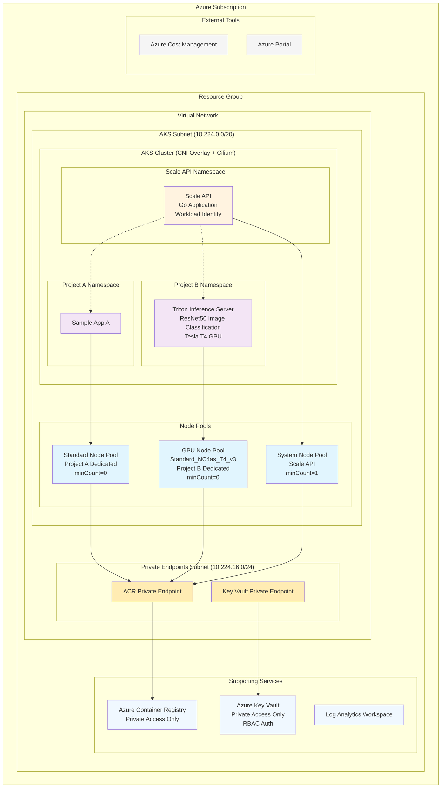

# AKS Scale to Zero - 機能仕様

## プロジェクト概要

### 解決したい課題
AKS（Azure Kubernetes Service）のコスト最適化を実現し、複数プロジェクトでクラスタを共有しながら、使用していない時間帯のリソースコストを削減する。特にGPUノードのような高額なインスタンスのコスト削減が重要。

KEDAで、処理量に応じてPodのレプリカ数を0にできる。合わせてCluster Autoscalerを組み合わせれば、ノードのScale to Zeroは可能。ただしGPUノードでイメージサイズの大きなAI/ML向けPodを動かすケースでは、ノードを消してしまうと、再度起動するのに長い時間がかかりがちである。オンライン推論では、使われるタイミングで起動しておきたい。よって手動で明示的に起動とScale to Zeroができると良い。

また、GPUノードの割り当て、最適化手段として[Kubernetes AI Toolchain Operator(KAITO)](https://learn.microsoft.com/ja-jp/azure/aks/ai-toolchain-operator)があるが、KAITOよりもシンプルな代替案もあると良い。

### 実現したい価値
- **具体例**: ノードのコスト最適化 - 高額なGPUインスタンスを使用していない時間帯は完全にゼロにスケール
- **リソース効率化**: 複数プロジェクトでのAKSクラスタ共有による運用効率向上
- **柔軟なスケーリング**: プロジェクトごとの専用ノードプールによる分離とスケーリング
- **権限移譲** ノードプールの起動やScale to Zeroを管理者が作業することなく、プロジェクトメンバーがAPIを通じ操作

### プロジェクトスコープ
- **サンプル・リファレンス**: AKS Scale to Zero の基本概念を示すシンプルな実装
- **インフラ構築**: Bicep テンプレートによるAKSと周辺Azureリソースの構築
- **Scale API**: Go実装のDeploymentスケール制御API
- **Azure Development CLI対応**: azdコマンドによる統合デプロイメント

## 実装状況について

このドキュメントは機能仕様を定義します。実装状況や進捗については[実装プラン](plan.md)を参照してください。

## システム構成図



## リポジトリ構成

### Azure Development CLI 対応構造
```
aks-scale-to-zero/
├── azure.yaml                 # Azure Developer CLI設定
├── infra/                     # Bicepインフラテンプレート
│   ├── main.bicep            # メインテンプレート（サブスクリプションスコープ）
│   ├── main.bicepparam       # サンプル環境パラメータ
│   └── modules/              # 再利用可能モジュール
│       ├── vnet.bicep       # 仮想ネットワーク（プライベートエンドポイント対応）
│       ├── aks.bicep        # AKSクラスタ（CNI Overlay + Cilium）
│       ├── nodepool.bicep   # ノードプール（Scale to Zero対応）
│       ├── acr.bicep        # Container Registry（プライベートエンドポイント）
│       ├── acr-role-assignment.bicep # ACR RBAC設定
│       ├── log.bicep        # Log Analytics
│       └── keyvault.bicep   # Key Vault（プライベートエンドポイント）
├── src/                      # アプリケーションソースコード
│   ├── api/                 # Go Scale API実装
│   │   ├── main.go         # エントリーポイント
│   │   ├── Dockerfile      # Scale API用コンテナイメージ
│   │   ├── go.mod          # Go依存関係管理
│   │   ├── go.sum          # Go依存関係ロック
│   │   ├── kustomization.yaml  # Kustomize設定
│   │   ├── handlers/       # APIハンドラー
│   │   │   ├── deployment.go
│   │   │   └── health.go
│   │   ├── models/         # データモデル
│   │   │   └── deployment.go
│   │   ├── k8s/           # Kubernetes クライアント
│   │   │   └── client.go
│   │   ├── middleware/     # ミドルウェア（認証、ログ）
│   │   │   ├── auth.go
│   │   │   └── logging.go
│   │   ├── utils/         # ユーティリティ
│   │   │   └── response.go
│   │   ├── config/        # 設定管理
│   │   │   └── config.go
│   │   └── manifests/     # Scale APIのKubernetesマニフェスト
│   │       ├── deployment.yaml
│   │       ├── service.yaml
│   │       ├── rbac.yaml
│   │       └── serviceaccount.yaml
│   └── samples/            # サンプルアプリケーション
│       ├── app-a/         # Project A用サンプルアプリ
│       │   ├── Dockerfile
│       │   ├── index.html
│       │   ├── nginx.conf
│       │   ├── kustomization.yaml
│       │   └── manifests/
│       │       ├── deployment.yaml
│       │       └── service.yaml
│       └── app-b/         # Project B用サンプルアプリ
│           ├── Dockerfile
│           ├── index.html
│           ├── nginx.conf
│           ├── kustomization.yaml
│           └── manifests/
│               ├── deployment.yaml
│               └── service.yaml
├── scripts/                  # デプロイ・運用スクリプト
│   └── cleanup-failed-azd.sh # 失敗したazdデプロイのクリーンアップ
├── docs/                    # ドキュメント
│   ├── spec.md             # 機能仕様（このファイル）
│   └── plan.md             # 実装プラン
└── tests/                   # テストファイル
    ├── integration/        # 統合テスト（シェルスクリプト）
    │   ├── test-scale-api.sh
    │   ├── test-scale-to-zero.sh
    │   └── test-get-status.sh
    └── unit/              # ユニットテスト
```

## 主要ユーザーと使用シナリオ

### 主要ユーザー
- **クラスタ管理者**: AKSクラスタの全体運用・管理、システム設計
- **アプリケーション管理者**: プロジェクトのアプリケーション管理、日常的なスケール操作

### 使用シナリオ

#### GPU推論アプリケーションでのScale to Zero
- **状況**: Project BがNVIDIA Triton Inference Serverを使用したGPU推論サービスを運用
- **アプリケーション**: ResNet50による画像分類API（Tesla T4 GPU使用）
- **動作**: Scale APIを使用してTriton Inference ServerのDeploymentレプリカ数を0に変更

## 機能要件

### 必須機能（MVP）

#### 1. Bicep インフラストラクチャ
- **仮想ネットワーク**: プライベートエンドポイント対応のVNet
- **AKSクラスタ**: Azure CNI Overlay + Ciliumデータプレーン
- **専用ノードプール**: Project A（標準）, Project B（GPU）専用のノードプール
- **GPUノードプール対応**: Project B用Tesla T4 GPU対応ノードプール（Standard_NC4as_T4_v3）
- **スケールトゥゼロ対応**: minCount=0でのノードプール設定（GPU含む）
- **プライベートエンドポイント**: ACR、Key Vaultへの安全な接続
- **マネージドID**: システム割り当てマネージドIDとWorkload Identity（機能拡張のために準備していますが、現在使っていません）
- **Supporting Services**: ACR、Log Analytics、Key Vaultの統合

#### 2. Scale API (Go実装)
- **RESTful API**: Deploymentスケール制御のHTTP API
- **サンプル実装**: 基本的なスケール機能のシンプルな実装
- **Kubernetes統合**: 同一クラスタ内での動作とRBAC対応
- **コンテナ化**: ACRからのイメージ配信

#### 3. Azure Development CLI統合
- **azure.yaml**: azdプロジェクト設定
- **統合デプロイ**: インフラとアプリケーションの一括デプロイ
- **サンプル環境**: 単一の"sample"環境設定

## 技術要件

### Azure Development CLI 設定

Azure Development CLI の設定は [`azure.yaml`](/azure.yaml) を参照してください。

**主な特徴**:
- 4つのサービス定義（nvidia-plugin、scale-api、sample-app-a、sample-app-b）
  - nvidia-plugin: GPU リソース管理用の NVIDIA Device Plugin DaemonSet
- 各サービスはDockerコンテナとしてビルド
- Kustomizeを使用した動的なイメージ名設定
- 各サービスのKubernetesマニフェストは各プロジェクトディレクトリ内に配置

### インフラストラクチャ（Bicep）

#### 構築対象リソース
- **Virtual Network**: 
  - AKS用サブネット（10.224.0.0/20）
  - プライベートエンドポイント用サブネット（10.224.16.0/24）
  - NSGによるセキュリティ制御
- **AKS Cluster**: 
  - Kubernetes v1.32以上
  - Azure CNI Overlayモード（Pod CIDR: 10.244.0.0/16）
  - Ciliumデータプレーン（eBPFベース）
  - Workload Identity有効化（OIDC Issuer） - 機能拡張のためにAKSで有効にしていますが、現在使っていません
- **Node Pools**: 
  - System Pool (Scale API用、minCount=1)
  - Project A Pool (Standard、minCount=0)
  - Project B Pool (GPU: Standard_NC4as_T4_v3、minCount=0)
- **Azure Container Registry**: 
  - プライベートエンドポイント経由のアクセス
  - 管理者ユーザー無効化（マネージドID認証）
- **Log Analytics Workspace**: 監視・ログ集約
- **Azure Key Vault**: 
  - プライベートエンドポイント経由のアクセス
  - RBACベースのアクセス制御
  - パージ保護無効（サンプル環境用）
  - 機能拡張のために準備していますが、現在使っていません
- **Managed Identity**: 
  - システム割り当てマネージドID（AKS）
  - Workload Identity（Pod内ワークロード） - 機能拡張のために準備していますが、現在使っていません

#### Bicep モジュール設計
- **main.bicep**: サブスクリプションスコープのオーケストレーション
- **vnet.bicep**: 仮想ネットワークとPrivate DNS Zones
- **aks.bicep**: AKSクラスタ（CNI Overlay + Cilium）
- **nodepool.bicep**: ユーザーノードプール（Project A, B用）
- **acr.bicep**: Container Registry + プライベートエンドポイント
- **log.bicep**: Log Analytics Workspace
- **keyvault.bicep**: Key Vault + プライベートエンドポイント
- **acr-role-assignment.bicep**: ACRへのRBAC設定

### Scale API 実装（Go）

#### アプリケーション構成
```
src/api/
├── main.go                    # エントリーポイント
├── config/
│   └── config.go             # 設定管理
├── handlers/
│   ├── deployment.go         # Deployment操作
│   └── health.go            # ヘルスチェック
├── models/
│   └── deployment.go         # Deploymentモデル
├── k8s/
│   └── client.go            # Kubernetesクライアント
├── middleware/
│   ├── auth.go              # 認証ミドルウェア
│   └── logging.go           # ロギング
├── utils/
│   └── response.go          # レスポンスヘルパー
└── testing/                 # テスト用ヘルパー、モック
    ├── mocks/
    │   └── k8s_client.go   # Kubernetesクライアントモック
    └── helpers/
        └── test_helpers.go # テストヘルパー関数
```

#### Kubernetesマニフェスト配置
各サービスのKubernetesマニフェストは、Azure Developer CLI の推奨に従い、各プロジェクトディレクトリ内に配置されています：

**Scale API** (`src/api/manifests/`):
- `deployment.yaml` - Deployment定義
- `service.yaml` - Service定義（ClusterIP）
- `rbac.yaml` - ClusterRoleとClusterRoleBinding
- `serviceaccount.yaml` - ServiceAccount定義

**Sample App A** (`src/samples/app-a/manifests/`):
- `deployment.yaml` - nginx Deployment（Project Aノードプール指定）
- `service.yaml` - Service定義（LoadBalancer）

**Sample App B** (`src/samples/app-b/manifests/`):
- `deployment.yaml` - Triton Inference Server Deployment（Project B GPUノードプール指定）
- `service.yaml` - Service定義（LoadBalancer）

**注意**: 
- 名前空間はAzure Developer CLIによって自動的に作成されます（`scale-system`、`project-a`、`project-b`）
- 各サービスは独立したKustomize設定を持ち、Azure Developer CLIがビルド時にイメージ名を動的に設定します
- 統合された `/manifests/` ディレクトリは存在せず、各サービスが自己完結型の構成となっています

#### 主要なGo依存関係
- `k8s.io/client-go`: Kubernetes API クライアント
- `k8s.io/apimachinery`: Kubernetes API タイプ
- `github.com/gin-gonic/gin`: HTTP フレームワーク
- `github.com/golang-jwt/jwt`: JWT認証（オプション）

## コスト管理について

### Azureネイティブツールの活用
- **Azure Cost Management**: リソースグループ・サブスクリプション単位でのコスト分析
- **Azure Portal**: リアルタイムでのリソース使用状況とコスト確認
- **Azure CLI**: `az consumption` コマンドによるコスト情報取得
- **AKS Cost Analysis Add-on**: Namespace単位でのコスト分析（プレビュー機能）

### 推奨コスト管理フロー
1. **Scale API**: アプリケーションのScale to Zero実行
2. **Azure Portal**: コスト削減効果の確認
3. **定期確認**: Azure Cost Management での月次コスト分析

## Project B - GPU推論アプリケーション仕様

### NVIDIA Triton Inference Server構成

#### アプリケーション概要
- **ベースイメージ**: `nvcr.io/nvidia/tritonserver:23.10-py3`
- **GPUリソース**: Tesla T4 GPU × 1（Standard_NC4as_T4_v3）
- **推論モデル**: ResNet50（ONNX形式、ImageNet事前訓練済み）
- **API形式**: HTTP/gRPC推論エンドポイント
- **想定用途**: 画像分類サービス（デモ・学習用）

#### Technical Specifications

**コンテナ仕様**:
```yaml
image: nvcr.io/nvidia/tritonserver:23.10-py3
resources:
  requests:
    nvidia.com/gpu: 1
    memory: "2Gi"
    cpu: "1000m"
  limits:
    nvidia.com/gpu: 1
    memory: "4Gi"
    cpu: "2000m"
nodeSelector:
  project: "b"
  workload: "gpu"
tolerations:
  - key: "sku"
    operator: "Equal"
    value: "gpu"
    effect: "NoSchedule"
env:
  - name: NVIDIA_VISIBLE_DEVICES
    value: "all"
  - name: NVIDIA_DRIVER_CAPABILITIES
    value: "compute,utility"
securityContext:
  allowPrivilegeEscalation: false
  runAsNonRoot: false # Triton Server requires root for GPU access
  capabilities:
    drop:
      - ALL
    add:
      - SYS_ADMIN # Required for GPU access
```

**モデル構成**:
```
/models/
└── resnet50/
    ├── 1/
    │   └── model.onnx          # ResNet50 ONNX モデル
    └── config.pbtxt            # Triton設定
```

**Triton設定（config.pbtxt）**:
- プラットフォーム: ONNX Runtime
- 最大バッチサイズ: 8
- 入力: data（TYPE_FP32、NCHW形式、[3, 224, 224]）
- 出力: resnetv17_dense0_fwd（TYPE_FP32、[1000]）
- インスタンスグループ: GPU × 1
- 最適化: CUDA graphsを有効化
- 動的バッチング: 最大遅延100マイクロ秒

#### API エンドポイント

**推論API**:
```http
POST /v2/models/resnet50/infer
Content-Type: application/json

{
  "inputs": [{
    "name": "data",
    "shape": [1, 3, 224, 224],
    "datatype": "FP32",
    "data": [...] // 画像データ（Base64エンコード）
  }]
}
```

**レスポンス例**:
```json
{
  "outputs": [{
    "name": "resnetv17_dense0_fwd",
    "shape": [1, 1000],
    "datatype": "FP32",
    "data": [...] // ImageNet 1000クラス分類結果
  }]
}
```

**管理API**:
- `GET /v2/health/ready` - サーバー準備状態確認
- `GET /v2/health/live` - サーバーヘルスチェック
- `GET /v2/models/resnet50` - モデル情報取得
- `POST /v2/models/resnet50/load` - モデル動的ロード

#### コンテナ動作仕様

**起動時の動作**:
1. モデルファイルの存在確認（/models/resnet50/1/model.onnx）
2. モデルが存在しない場合は自動ダウンロード（/opt/download-model.sh実行）
3. Triton Inference Serverの起動（--strict-model-config=false、--log-verbose=1）
4. ヘルスチェック（30秒間隔、/v2/health/readyエンドポイント）

**ポート設定**:
- 8000: HTTP推論エンドポイント
- 8001: gRPC推論エンドポイント
- 8002: メトリクスエンドポイント

**ヘルスチェック仕様**:
- Liveness Probe: /v2/health/live（初期遅延60秒、周期30秒）
- Readiness Probe: /v2/health/ready（初期遅延30秒、周期10秒）

#### Scale to Zero統合

**スケーリング動作**:
1. **Scale to Zero**: Triton Server Deployment → 0レプリカ → GPUノード自動削除
2. **ノード作成/スケールアウト**: API呼び出し → GPUノード起動 → Triton Server起動 → モデルダウンロード → モデルロード

#### 実装ファイル構成

**Project B専用構成**:
```
src/samples/app-b/
├── Dockerfile              # Triton Server + ResNet50モデル
├── models/                  # モデルファイル
│   └── resnet50/
│       ├── 1/model.onnx    # ResNet50 ONNXモデル
│       └── config.pbtxt    # Triton設定
├── scripts/
│   ├── download-model.sh   # モデルダウンロードスクリプト
│   └── test-inference.py   # 推論テストスクリプト
├── kustomization.yaml      # Kustomize設定
└── manifests/
    ├── deployment.yaml     # GPU Deployment
    └── service.yaml        # LoadBalancer Service
```

## 制約条件

### ビジネス制約
- **サンプル用途**: 概念実証・学習目的
- **シンプル構成**: 2つのプロジェクト、1つの環境のみ
- **基本機能**: Scale to Zero の基本概念の実証

### 技術制約
- **Azure Development CLI対応**: azdコマンドでの統合デプロイ必須
- **Bicep実装**: ARM テンプレートではなくBicep使用
- **AKS制限**: Azure AKSの制限に準拠
- **サンプル規模**: 最小限のリソース構成

### 運用制約
- **学習目的**: 本番運用ではなく概念実証・学習目的
- **シンプル運用**: 複雑な運用手順を排除
- **サンプルデータ**: 実際のプロダクションデータは使用しない

## デプロイメント手順

### Azure Development CLI によるデプロイ

#### 1. 初期セットアップ
```bash
# Azure Developer CLI のインストール
# https://docs.microsoft.com/en-us/azure/developer/azure-developer-cli/install-azd

# プロジェクトの初期化
azd init

# Azure環境の作成（sample環境）
azd env new sample
azd env set AZURE_LOCATION japaneast
```

#### 2. インフラストラクチャのデプロイ
```bash
# Bicepテンプレートのデプロイ
azd provision

# 作成されるリソース:
# - Resource Group
# - AKS Cluster (システムノードプール)
# - Project A/B ノードプール (Scale to Zero対応)
# - Azure Container Registry
# - Log Analytics Workspace  
# - Key Vault
# - Managed Identity
# - Virtual Network (プライベートエンドポイント対応)
```

#### 3. アプリケーションのデプロイ
```bash
# Scale APIとサンプルアプリのビルドとデプロイ
azd deploy

# 実行される処理:
# - アプリケーションのコンテナ化
# - ACRへのイメージプッシュ
# - Kubernetes マニフェストの適用 (Kustomize経由)
# - RBAC設定の適用
```

## Scale API 仕様

### エンドポイント設計

#### 1. Deployment スケール制御
```
POST /api/v1/deployments/{namespace}/{deployment-name}/scale-to-zero
Content-Type: application/json

{
  "reason": "コスト最適化のため",
  "scheduled_scale_up": "2025-07-15T09:00:00Z" // オプション
}
```

**レスポンス:**
```json
{
  "status": "success",
  "message": "Deployment scaled to zero",
  "deployment": "sample-app-a",
  "namespace": "project-a",
  "previous_replicas": 2,
  "timestamp": "2025-07-14T18:00:00Z"
}
```

#### 2. スケールアップ
```
POST /api/v1/deployments/{namespace}/{deployment-name}/scale-up
Content-Type: application/json

{
  "replicas": 2,
  "reason": "サンプルアプリ開始のため"
}
```

#### 3. ステータス確認
```
GET /api/v1/deployments/{namespace}/{deployment-name}/status
```

**レスポンス:**
```json
{
  "deployment": "sample-app-a",
  "namespace": "project-a",
  "current_replicas": 0,
  "desired_replicas": 0,
  "available_replicas": 0,
  "status": "scaled-to-zero",
  "last_scale_time": "2025-07-14T18:00:00Z"
}
```

### 認証・認可
- **Workload Identity**: PodからAzureリソースへのアクセス（機能拡張のために準備していますが、現在使っていません）
- **RBAC**: Kubernetes Role-Based Access Control
- **Namespace分離**: プロジェクト別のアクセス制御
- **マネージドID優先**: Key Vault使用は最小限に

### その他
- **VNet内通信**: クラスタ内通信のセキュア化
- **構造化ロギング**: JSON形式のAPI アクセスログ（リクエストID付き）
- **ヘルスチェックエンドポイント**: 認証不要の `/health` と `/ready`

## プロジェクト別コスト管理

### Azureネイティブツールの活用
- **Azure Cost Management**: リソースグループ・サブスクリプション単位でのコスト分析
- **Azure Portal**: リアルタイムでのリソース使用状況とコスト確認
- **Azure CLI**: `az consumption` コマンドによるコスト情報取得
- **AKS Cost Analysis Add-on**: Namespace単位でのコスト分析（プレビュー機能）

### 推奨コスト管理フロー
1. **Scale API**: アプリケーションのScale to Zero実行
2. **Azure Portal**: コスト削減効果の確認
3. **定期確認**: Azure Cost Management での月次コスト分析

### 成功指標

### コスト最適化
- **コンセプト実証**: Scale to Zero によるコスト削減効果の実証
- **学習効果**: AKS ノードプールとコスト管理の理解
- **Azureネイティブ**: Azure標準ツールでのコスト把握

### 運用効率
- **デプロイメント効率**: Azure Development CLI による統合デプロイ
- **インフラ管理**: Bicep による Infrastructure as Code
- **シンプルAPI**: Scale to Zero に特化したAPIによる簡単操作

## 実装の優先順位と次のステップ

### MVP機能（必須実装）

#### 1. ユーザーノードプール実装
- **ファイル**: `infra/modules/nodepool.bicep`
- **概要**: Project A/B用のScale to Zero対応ノードプール

#### 2. Scale API - Go実装  
- **ファイル**: `src/api/main.go`, `src/api/handlers/`, `src/api/models/`
- **概要**: Deploymentスケール制御のRESTful API

#### 3. コンテナ化とKubernetesマニフェスト
- **ファイル**: `src/api/Dockerfile`, `src/api/manifests/*.yaml`, `src/samples/*/manifests/*.yaml`  
- **概要**: Scale APIとサンプルアプリのデプロイメント基盤

### 機能拡張（拡張実装）

#### 4. Project B Pool - GPU対応ノードプール
- **概要**: Tesla T4 GPU対応ノードプール（Standard_NC4as_T4_v3）への変更
- **必要な変更**: VMサイズ変更、GPU用ラベル・taints設定、コスト最適化

#### 5. Project B - GPU推論アプリケーション
- **概要**: NVIDIA Triton Inference ServerによるGPU推論サービス
- **効果**: Tesla T4 GPUを使用した実際のコスト削減デモンストレーション
- **実装内容**: ResNet50による画像分類API、GPUリソース管理、Scale to Zero対応

## テスト仕様

### テスト戦略

#### テスト環境
- **ユニットテスト**: ローカル環境（Kubernetes環境不要、モック使用）
- **統合テスト**: 実際のAKS環境（Azure Kubernetes Service）

### ユニットテスト仕様

#### ユニットテスト基本方針
- **Kubernetes環境不要**: すべてのユニットテストはKubernetes環境なしで実行可能
- **テストダブル使用**: 外部依存（Kubernetesクライアント、HTTP通信など）はモック、スタブ、フェイクなどのテストダブルで置き換え
- **高速実行**: 各テストは100ms以内に完了
- **独立性**: テスト間の依存関係なし、並列実行可能
- **決定的**: 同じ条件で常に同じ結果
- **外部通信なし**: ネットワーク通信、ファイルシステム、データベースアクセスなし

#### モック戦略
```go
// Kubernetesクライアントのモック例
type mockK8sClient struct {
    mock.Mock
}

func (m *mockK8sClient) ScaleDeployment(ctx context.Context, namespace, name string, replicas int32) error {
    args := m.Called(ctx, namespace, name, replicas)
    return args.Error(0)
}

// 使用例
mockClient := new(mockK8sClient)
mockClient.On("ScaleDeployment", mock.Anything, "project-a", "sample-app-a", int32(0)).Return(nil)
```

#### 1. ハンドラーテスト (`handlers/*_test.go`)

**DeploymentHandler テスト**
```go
// テストケース例
- TestScaleToZero_Success: 正常なスケールダウン（モックK8sクライアント使用）
- TestScaleToZero_DeploymentNotFound: 存在しないDeployment（エラーを返すモック）
- TestScaleToZero_InvalidNamespace: 無効なNamespace
- TestScaleToZero_AlreadyScaledToZero: 既にスケール済み
- TestScaleUp_Success: 正常なスケールアップ
- TestScaleUp_InvalidReplicaCount: 無効なレプリカ数
- TestGetStatus_Success: ステータス取得成功
```

**テスト実装例**
```go
func TestScaleToZero_Success(t *testing.T) {
    // モックK8sクライアント作成
    mockClient := new(mockK8sClient)
    mockClient.On("GetDeploymentStatus", mock.Anything, "project-a", "app-a").
        Return(&DeploymentStatus{CurrentReplicas: 2}, nil)
    mockClient.On("ScaleDeployment", mock.Anything, "project-a", "app-a", int32(0)).
        Return(nil)
    
    // ハンドラー作成
    handler := NewDeploymentHandler(mockClient)
    
    // HTTPテスト
    router := gin.New()
    router.POST("/scale-to-zero/:namespace/:deployment", handler.ScaleToZero)
    
    w := httptest.NewRecorder()
    req := httptest.NewRequest("POST", "/scale-to-zero/project-a/app-a", nil)
    router.ServeHTTP(w, req)
    
    // アサーション
    assert.Equal(t, 200, w.Code)
    mockClient.AssertExpectations(t)
}
```

**HealthHandler テスト**
```go
- TestHealthCheck_Success: ヘルスチェック成功（常に200を返す）
- TestReadinessCheck_Success: 準備完了チェック成功（モックK8sクライアントが正常）
- TestReadinessCheck_KubernetesDown: K8s接続失敗時（エラーを返すモック）
```

#### 2. Kubernetesクライアントテスト (`k8s/client_test.go`)

**フェイククライアント戦略**
```go
// k8s.io/client-go/fakeを使用
import (
    "k8s.io/client-go/kubernetes/fake"
    appsv1 "k8s.io/api/apps/v1"
)

func TestScaleDeployment_Success(t *testing.T) {
    // フェイクDeployment作成
    deployment := &appsv1.Deployment{
        ObjectMeta: metav1.ObjectMeta{
            Name: "test-app",
            Namespace: "test-ns",
        },
        Spec: appsv1.DeploymentSpec{
            Replicas: ptr.To(int32(3)),
        },
    }
    
    // フェイククライアント作成
    fakeClientset := fake.NewSimpleClientset(deployment)
    client := &Client{clientset: fakeClientset}
    
    // スケール実行
    err := client.ScaleDeployment(context.Background(), "test-ns", "test-app", 0)
    
    // 検証
    assert.NoError(t, err)
    updated, _ := fakeClientset.AppsV1().Deployments("test-ns").Get(context.Background(), "test-app", metav1.GetOptions{})
    assert.Equal(t, int32(0), *updated.Spec.Replicas)
}
```

**テストケース**
```go
- TestNewClient_InCluster: クラスタ内実行時の初期化（環境変数モック）
- TestNewClient_OutOfCluster: クラスタ外実行時の初期化（kubeconfigモック）
- TestScaleDeployment_Success: Deployment更新成功（フェイククライアント）
- TestScaleDeployment_Conflict: 更新競合時のリトライ（カスタムReactor使用）
- TestGetDeployment_Success: Deployment取得成功
- TestGetDeployment_NotFound: 404エラー処理
```

#### 3. ミドルウェアテスト (`middleware/*_test.go`) - 実装済み

**認証ミドルウェア**
```go
- TestAuthMiddleware_ValidAPIKey: 正しいAPIキー（環境変数モック）
- TestAuthMiddleware_InvalidAPIKey: 無効なAPIキー
- TestAuthMiddleware_MissingAPIKey: APIキー未設定
- TestAuthMiddleware_HealthEndpointBypass: ヘルスエンドポイントはスキップ
```

**ロギングミドルウェア**
```go
- TestLoggingMiddleware_RequestLogging: リクエストログ出力（バッファライター使用）
- TestLoggingMiddleware_ResponseTime: レスポンス時間計測
- TestLoggingMiddleware_RequestID: リクエストID生成
```

#### 4. 設定管理テスト (`config/config_test.go`)

```go
func TestLoadConfig_EnvironmentVariables(t *testing.T) {
    // 環境変数を一時的に設定
    t.Setenv("PORT", "9090")
    t.Setenv("API_KEY", "test-key")
    t.Setenv("LOG_LEVEL", "debug")
    
    config := LoadConfig()
    
    assert.Equal(t, "9090", config.Port)
    assert.Equal(t, "test-key", config.APIKey)
    assert.Equal(t, "debug", config.LogLevel)
}
```

### テストユーティリティ

#### モックヘルパー
```go
// tests/mocks/k8s_client.go
type MockK8sClient struct {
    mock.Mock
}

// インターフェース実装
func (m *MockK8sClient) ScaleDeployment(ctx context.Context, namespace, name string, replicas int32) error {
    args := m.Called(ctx, namespace, name, replicas)
    return args.Error(0)
}

// tests/helpers/test_helpers.go
func SetupTestRouter() *gin.Engine {
    gin.SetMode(gin.TestMode)
    router := gin.New()
    return router
}
```

### 統合テスト仕様

統合テストは実際のKubernetes環境でScale APIの動作を検証するシェルスクリプトとして実装されています。

#### テスト環境要件
- **Kubernetes環境**: 実際のAKSクラスタ（azd deployによるデプロイ済み）
- **kubectl**: AKSクラスタへのアクセス設定済み
- **jq**: JSONレスポンスの解析用
- **curl**: API呼び出し用

#### 実装済み統合テスト

##### 1. Scale API基本テスト (`tests/integration/test-scale-api.sh`)

**概要**: Scale APIの基本機能とレプリカ数変更操作を検証

**テスト内容**:
```bash
1. ヘルスチェックエンドポイント (/health) の動作確認
2. 準備状態エンドポイント (/ready) の動作確認  
3. デプロイメントステータス取得 (GET /api/v1/deployments/{namespace}/{deployment}/status)
4. 3レプリカへのスケールアップ実行 (POST /api/v1/deployments/{namespace}/{deployment}/scale-up)
5. APIステータスエンドポイントでのスケールアップ検証（10秒待機後）
6. 実際のデプロイメントレプリカ数確認 (kubectl get deployment)
7. 2レプリカへのスケールダウン実行 (POST /api/v1/deployments/{namespace}/{deployment}/scale-up)
8. スケールダウン結果の検証（10秒待機後）
9. Scale to Zero実行 (POST /api/v1/deployments/{namespace}/{deployment}/scale-to-zero)
10. Scale to Zero結果の検証（10秒待機後）
11. ゼロから1レプリカへの復帰テスト
12. 復帰結果の検証（10秒待機後）
```

**使用方法**:
```bash
# デフォルト（project-a/sample-app-a）
./test-scale-api.sh

# カスタムターゲット指定
# 引数1: namespace名（例：project-a, project-b）
# 引数2: deployment名（例：sample-app-a, sample-app-b）
./test-scale-api.sh project-b sample-app-b
```

##### 2. Scale to Zero ノードテスト (`tests/integration/test-scale-to-zero.sh`)

**概要**: デプロイメントがゼロにスケールされた際のノードのScale to Zero動作を検証

**テスト内容**:
```bash
1. デプロイメントの存在確認
2. 1レプリカへのスケールアップ実行（ノードプロビジョニングのトリガー）
3. デプロイメントの準備完了待機（最大15分）
4. プロジェクト用ノードの存在確認（project={a|b}ラベル）
5. Scale to Zero実行 (POST /api/v1/deployments/{namespace}/{deployment}/scale-to-zero)
6. 全Podの終了確認（15秒待機後）
7. ノードのスケールダウン監視（最大20分）
   - 60秒ごとにノード数をチェック
   - 経過時間とノード数を表示
8. 最終的なノード数がゼロになったことの確認
```

**タイムアウト設定**:
- ノードスケールアップ: 900秒（15分）
- ノードスケールダウン: 1200秒（20分）
- API呼び出し: 30秒

**使用方法**:
```bash
# デフォルト（project-a/sample-app-a）
./test-scale-to-zero.sh

# カスタムターゲット指定
# 引数1: namespace名（例：project-a, project-b）
# 引数2: deployment名（例：sample-app-a, sample-app-b）
./test-scale-to-zero.sh project-b sample-app-b
```

##### 3. ステータス取得テスト (`tests/integration/test-get-status.sh`)

**概要**: デプロイメントステータスエンドポイントの機能とレスポンス検証

**テスト内容**:
```bash
1. ヘルスチェックエンドポイント (/health) の動作確認
2. 準備状態エンドポイント (/ready) の動作確認
3. 基本的なステータスエンドポイント機能確認（200 OK）
4. ステータスレスポンス構造の検証:
   - deployment.name フィールドの存在と値
   - deployment.namespace フィールドの存在と値
   - deployment オブジェクトの存在
   - deployment.desired_replicas フィールドの存在
   - deployment.current_replicas フィールドの存在
5. レプリカ数の数値検証（0以上の整数）
6. エラーハンドリング:
   - 存在しないデプロイメント（404エラー）
   - 存在しないnamespace（404エラー）
7. レスポンス時間パフォーマンステスト（2秒以内）
8. 連続リクエスト安定性テスト（5回連続）
9. JSONレスポンスフォーマット検証
```

**使用方法**:
```bash
# デフォルト（project-a/sample-app-a）
./test-get-status.sh

# カスタムターゲット指定
# 引数1: namespace名（例：project-a, project-b）
# 引数2: deployment名（例：sample-app-a, sample-app-b）
./test-get-status.sh project-b sample-app-b
```

##### 4. GPU Triton Inference Server テスト (`tests/integration/test-triton-inference.sh`)

**概要**: NVIDIA Triton ServerのGPU Scale to Zero機能を検証

**テスト内容**:
```bash
1. GPUノードプールの可用性確認（workload=gpuラベル）
2. デプロイメントの現在の状態確認
3. Scale APIへのポートフォワード設定
4. GPU deploymentのスケールアップ実行（未実行の場合のみ）
5. デプロイメントの準備完了待機（最大15分）
6. GPUポッドの実行状態確認
7. Triton Serverへのポートフォワード設定（HTTP:8000, gRPC:8001）
8. Triton Serverの準備完了待機（最大3分、10秒ごとに再試行）
9. Triton Serverヘルスエンドポイント確認
10. ResNet50モデルのロード確認
11. ResNet50推論機能テスト（Pythonによる実際の推論実行）
    - 正しいデータサイズ（1x3x224x224）の生成
    - 推論APIへのPOSTリクエスト
    - レスポンスの出力形状検証（1x1000クラス）
12. ポートフォワードのクリーンアップ
```

**タイムアウト設定**:
- API呼び出し: 30秒
- モデルロード: 120秒
- ノードスケールアップ: 900秒（15分）
- Triton準備完了: 180秒（3分）

**使用方法**:
```bash
# project-b/sample-app-b（GPU Triton Server）でのテスト実行
./test-triton-inference.sh

# 注意: このテストはGPU対応のAKSクラスターが必要
# GPUノードプールが存在しない場合はスキップされます
```

#### 共通機能

すべてのテストスクリプトに以下の共通機能が実装されています：

1. **ポートフォワード自動設定**: Scale API（scale-system/scale-api）へのアクセス
2. **自動クリーンアップ**: テスト終了時のポートフォワードプロセス終了
3. **カラー出力**: 視認性の高いテスト結果表示
4. **エラーハンドリング**: 接続失敗時の適切なエラー表示
5. **柔軟なターゲット指定**: namespace/deployment名のカスタマイズ可能


### テスト実行ガイド

#### ユニットテスト実行

##### Makefileによる簡易実行
`tests/unit/Makefile` を使用して、ユニットテストを簡単に実行できます：

```bash
# 基本的な使い方
cd tests/unit
make help              # ヘルプを表示
make test              # 全ユニットテスト実行
make coverage          # カバレッジ付きテスト実行
make coverage-html     # HTMLカバレッジレポート生成・表示
make lint              # コードのlint実行
make watch             # ファイル変更を監視してテスト自動実行

# 特定パッケージのテスト
make test-handlers     # handlersパッケージのみテスト
make test-k8s         # k8sパッケージのみテスト
make test-middleware  # middlewareパッケージのみテスト
make test-config      # configパッケージのみテスト
make test-utils       # utilsパッケージのみテスト

# その他の便利なコマンド
make quick            # 高速テスト（race detector無し）
make bench            # ベンチマーク実行
make check-coverage   # テスト未実装パッケージの確認
make ci               # CI用（lint + vet + test + coverage）
make clean            # テストアーティファクトのクリーンアップ

# 特定のテストのみ実行
make test-run TEST=TestScaleToZero

# デバッグモード
make debug TEST=TestScaleToZero
```

##### 手動実行
```bash
# 全ユニットテスト実行（Kubernetes環境不要）
cd src/api
go test ./... -v -cover

# カバレッジレポート生成
go test ./... -coverprofile=coverage.out
go tool cover -html=coverage.out -o coverage.html

# 並列実行
go test ./... -v -cover -parallel 4
```

#### 統合テスト実行

##### 前提条件
```bash
# AKSクラスタが動作していること
kubectl cluster-info
kubectl get nodes

# AKSクラスタに接続していること
# Azure CLIでAKSクレデンシャルを取得
az aks get-credentials --resource-group <resource-group> --name <cluster-name>

# AKS環境（azd deployによるデプロイ済み）が必要
# 統合テストはAKS環境でのみ実行可能

# 必要なツールの確認
kubectl version
jq --version
curl --version
```

##### テスト実行手順
```bash
# 統合テストディレクトリへ移動
cd tests/integration

# 実行権限を付与（初回のみ）
chmod +x *.sh

# 各テストを個別に実行
./test-scale-api.sh        # Scale API基本機能テスト
./test-scale-to-zero.sh    # Scale to Zero機能テスト
./test-get-status.sh       # ステータス取得テスト

# 特定のnamespace/deploymentを指定して実行
# 引数1: namespace名、引数2: deployment名
./test-scale-api.sh project-b sample-app-b

# すべてのテストを連続実行
for test in *.sh; do
    echo "Running $test..."
    ./"$test"
    echo "---"
done
```

##### テスト結果の確認
- 緑色の出力: テスト成功
- 赤色の出力: テスト失敗
- 黄色の出力: 警告や情報メッセージ
